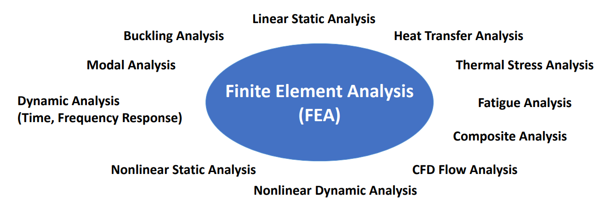

# Introduction

## why

### [What is Modal Analysis in FEA Simulation?](https://feaforall.com/video-what-is-modal-analysis-in-fea-simulation/)

在FEA中，您有几种类型的模拟：

可以将它们分为两个主要类别：静态模拟和动态模拟（我正在简化）：
- 静态模拟：系统没有移动
- 动态模拟：系统动态移动，并且这种行为对系统的行为产生影响。通常，动态影响是由几个因素引起的。 因此，惯性，系统的质量和阻尼。
