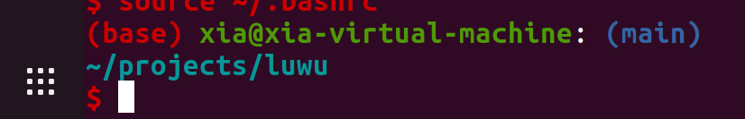
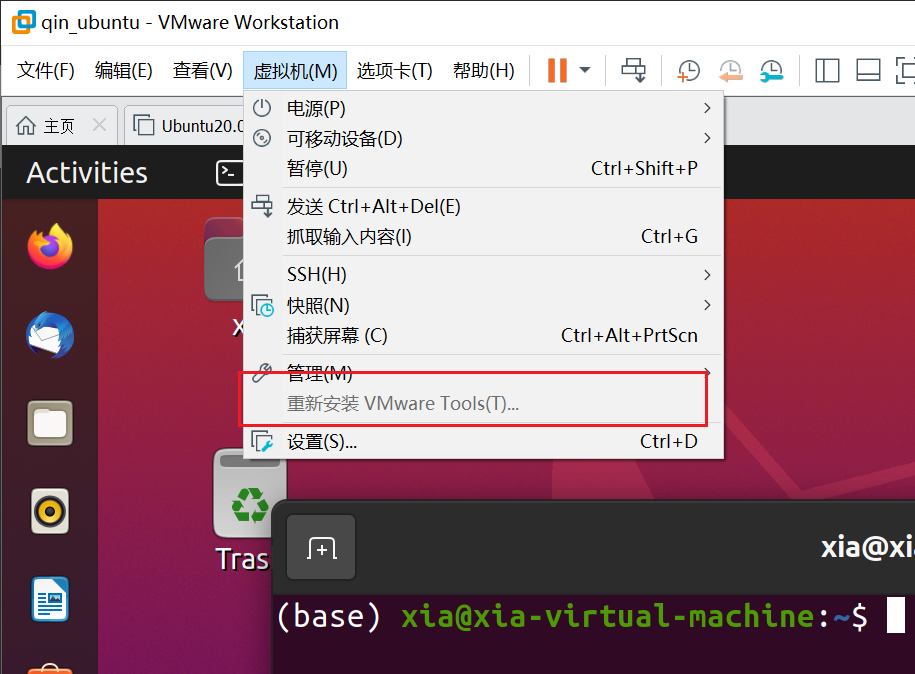
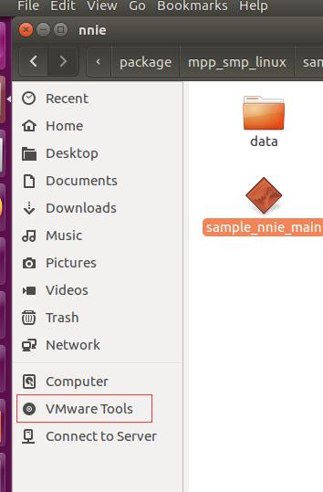

# 1. Linux基础

主要以ubuntu为主的技能积累

## 1.1. 系统检测

### 1.1.1. 实施检测

```powershell
htop # 界面比top更加好
sar -r 2 300 > memory_3txt 
# 间隔两秒之后输出内存使用情况，记录300次
```

## 1.2. 日常维护

### 1.2.1. 更新

```powershell
sudo apt-get update # 更新源
sudo apt-get upgrade # 更新已安装的包
```

```powershell
```

### 1.2.2. Linux终端设置

###　设置Linux命令提示符设置

[Linux命令提示符太长](https://blog.csdn.net/Bloddy/article/details/81638953)

```powershell
(moose) xia@xia-virtual-machine:
~/projects/luwu/src
$
```

需要修改 `~/.bashrc`

```powershell
if [ "$color_prompt" = yes ]; then
    PS1='${debian_chroot:+($debian_chroot)}\[\033[01;32m\]\u@\h\[\033[00m\]:\[\033[01;34m\]\n\w\[\033[00m\]\n\$ '
    # \[\033[01;32m\]\u：当前用户账号名称，
    #  \033[代码;前景;背景m],\[\033[1;32;40m\]表示高亮显示字体为绿色，背景色为黑色。
else
    PS1='${debian_chroot:+($debian_chroot)}\u@\h:\n\w\n\$ '
fi
```

#### 1.2.2.1. 特殊符号的含义

\d ：代表日期，格式为weekday month date，例如：”Mon Aug 1”
\H ：完整的主机名称。例如：我的机器名称为：fc4.linux，则这个名称就是fc4.linux
\h ：仅取主机的第一个名字，如上例，则为fc4，.linux则被省略
\t ：显示时间为24小时格式，如：HH：MM：SS
\T ：显示时间为12小时格式
\A ：显示时间为24小时格式：HH：MM
\u ：当前用户的账号名称
\v ：BASH的版本信息
\w ：完整的工作目录名称。家目录会以 ~代替
\W ：利用basename取得工作目录名称，所以只会列出最后一个目录
$ ：提示字符，如果是root时，提示符为：# ，普通用户则为：$

#### Linux终端显示git当前所在分支

修改 `.bashrc`

添加代码
```powershell
function git_branch {
   branch="`git branch 2>/dev/null | grep "^\*" | sed -e "s/^\*\ //"`"
   if [ "${branch}" != "" ];then
       if [ "${branch}" = "(no branch)" ];then
           branch="(`git rev-parse --short HEAD`...)"
       fi
       echo " ($branch)"
   fi
}
```

修改 `.bashrc` ,并修改了提示行的相关颜色

[Ubuntu Linux终端颜色个性化设置](https://os.51cto.com/art/202008/625040.htm)

```powershell
if [ "$color_prompt" = yes ]; then
        PS1='${debian_chroot:+($debian_chroot)}\[\033[01;32m\]\u@\h\[\033[00m\]:\[\033[01;34m\]$(git_branch)\n\[\033[01;31m\]\w\[\033[01;36m\]\n\$ '
else
        PS1='${debian_chroot:+($debian_chroot)}\u@\h:(git_branch)\n\w\n\$ '
fi
```

> 32m 绿色
> 34m 蓝色
> 36m 青蓝色
> 31m 红色

效果展示



### 给命令设置别名

```powershell
vim ~/.bashrc

# 添加代码
alias mk='make -j6'
alias cona='conda activate moose'
# 等号之间不能有空格
# 修改完成之后，运行下列代买
source ~/.bashrc
```

## 1.3. ubuntu-vm

### 1.3.1. window下虚拟机ubuntu与主机window系统复制粘贴文件的问题



如果是灰色的，需要重新启动虚拟机



将这个文件夹的tar文件复制到Desktop中，解压，之后运行 `vmware-install.pl`

键入如下命名，之后一路默认进行
```powershell
sudo ./vmware-install.pl
```


## Linux 软件安装

1. paraview安装 `sudo apt install paraview`


adduser

## 用户管理

### 添加用户

```powershell
adduser # 比较好，具有交互的界面
```